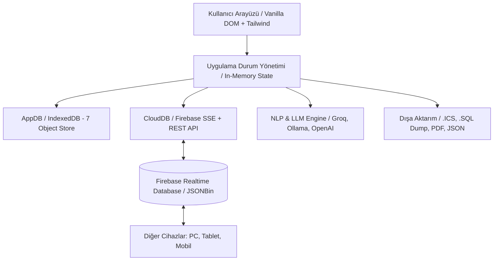
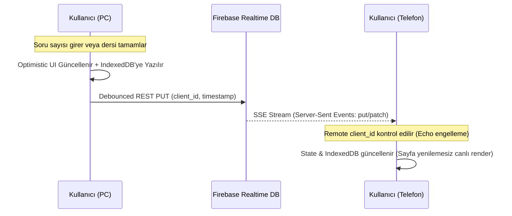
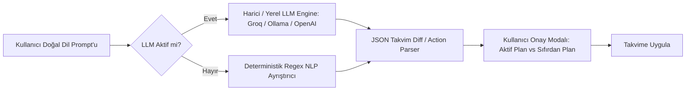

# 🛠️ YKS Akıllı Ders Planlayıcı — Teknik Mimari & Altyapı Dokümantasyonu
**Sürüm:** 2.5 (Netlify / GitHub Pages Uyumlu)  
**Hedef Kitle:** Yazılım Geliştiriciler, Çözüm Mimarları ve Sistem Mühendisleri  

---

## 1. 🌐 Genel Mimari Özet (Executive Architectural Summary)

YKS Akıllı Ders Planlayıcı; **"Offline-First" (Çevrimdışı Öncelikli)** ve **"Real-Time Cloud Synchronized" (Gerçek Zamanlı Bulut Eşitlemeli)** prensipleriyle geliştirilmiş, sıfır derleme adımı (No-Build Step) gerektiren modern bir **Single Page Application (SPA)** sistemidir.



### Temel Teknoloji Yığını (Tech Stack)
- **Çekirdek Dil:** Saf JavaScript (Vanilla ES6+ Modern Async/Await, Modular Object Pattern).
- **Arayüz & Stil:** HTML5 Semantic + Tailwind CSS (CDN) + Dinamik CSS Değişkenleri (CSS Variables / Theme Engine).
- **İstemci İçi Veritabanı:** HTML5 IndexedDB API (7 Tablo / Object Store).
- **Bulut & Canlı Senkronizasyon:** Firebase Realtime Database REST API + Server-Sent Events (SSE / `EventSource`) Stream. Yedek olarak JSONBin.io API.
- **Yapay Zeka (AI / NLP):** Groq Cloud API, Ollama / LM Studio (Local LLM), OpenAI API ve Kural Tabanlı Deterministik Regex NLP Ayrıştırıcı.
- **Dağıtım (Deployment):** GitHub Pages / Netlify / Vercel (Statik CDN Dağıtımı).

---

## 2. 💾 Veritabanı & Kalıcılık Katmanı (Storage & Persistence Layer)

Uygulama, web tarayıcılarının 5MB'lık dar ve senkron çalışan `localStorage` sınırını tamamen terk ederek, asenkron ve yüksek kapasiteli **IndexedDB** altyapısını kullanır (`app-db.js`).

### 2.1. IndexedDB Object Stores (Tablolar)

| Object Store Adı | Anahtar (KeyPath) | İçerik ve Amacı |
| :--- | :--- | :--- |
| `active_plan` | `day` (Integer) | 14 günlük aktif çalışma planının gün bazlı oturum (`sessions`) ağacı. |
| `curriculum` | `key` (String) | Tüm ders kategorileri (TYT, AYT, Geometri vb.) ve alt konu listeleri (`topics`). |
| `completed_sessions` | `id` (String) | Oturum tamamlama durumları (`{ sessionId: boolean }`). |
| `session_notes` | `sessionId` (String) | Oturuma ait not metni, toplam çözülen soru, doğru (D) ve yanlış (Y) sayıları. |
| `user_settings` | `key` (String) | Tema (`theme`), kart görünürlüğü (`cardVisibility`), zaman birimi (`timeUnit`), LLM ayarları. |
| `archived_plans` | `id` (String) | İleride geri yüklenmek üzere arşivlenen eski/tamamlanmış plan kopyaları. |
| `activity_logs` | `id` (AutoInc) | Sistem üzerinde yapılan işlemlerin zaman damgalı CRUD kütüğü (Audit Log). |

### 2.2. Veri Şemaları (Data Models)

#### A. Gün ve Oturum Modeli (`active_plan`):
```json
{
  "day": 1,
  "date": "2026-09-15",
  "timeRange": "09:00 - 15:30",
  "totalMinutes": 240,
  "sessions": [
    {
      "id": "sess_1_1726398123456_0",
      "topic": "Fonksiyon Temel",
      "subjectKey": "ayt_matematik",
      "durationMinutes": 120,
      "timeSlot": "09:00 - 11:00",
      "stage": "Yeni Konu",
      "stageBadge": "stage-new",
      "videoUrl": "https://youtu.be/DW5ppxQf00A",
      "order": 0
    }
  ]
}
```

#### B. Soru Takibi ve Oturum Notu Modeli (`session_notes`):
```json
{
  "sessionId": "sess_1_1726398123456_0",
  "text": "3. testteki bileşke fonksiyon sorularına tekrar bakılacak.",
  "totalQuestions": 40,
  "correct": 34,
  "wrong": 4,
  "updatedAt": "2026-09-15T11:20:00.000Z"
}
```

#### C. Parametrik Kart Görünürlük Modeli (`cardVisibility`):
```json
{
  "showVideo": true,
  "showNote": true,
  "showEdit": true,
  "showPomodoro": true,
  "showDelete": true,
  "showQuestions": true,
  "showQuickNote": true
}
```

---

## 3. ☁️ Gerçek Zamanlı Bulut Senkronizasyonu (CloudDB Architecture)

`cloud-db.js`, çoklu cihaz (PC, Tablet, Akıllı Telefon) arasında kullanıcı oturumu veya login zorunluluğu olmadan anlık veri eşitlemesi sağlar.



### 3.1. Sonsuz Döngü (Echo Loop) Engelleme Algoritması
1. Her tarayıcı sekmesi açıldığında benzersiz bir `clientId` (`client_xxxx_timestamp`) üretir.
2. Buluta veri gönderilirken payload içerisine `lastClientId` ve `updatedAt` damgası eklenir.
3. SSE üzerinden gelen veri paketindeki `lastClientId` mevcut sekmenin kimliğiyle eşleşiyorsa paket yok sayılır (`ignore own echo`).
4. Veri transferi 800ms'lik debounced kuyruk (`schedulePush`) üzerinden yürütülerek sunucu kotası ve ağ trafiği optimize edilir.

---

## 4. 🧠 Doğal Dil İşleme (NLP) ve LLM Entegrasyonu

Kullanıcının Türkçe doğal dille verdiği komutlar iki kademeli bir pipeline ile işlenir:



1. **Deterministik Regex Ayrıştırıcı (`parseNaturalLanguageInput`):** Saat, dakika, gün numarası ve müfredat konu eşleştirmelerini yerel regex kurallarıyla sıfır gecikmeyle ayrıştırır.
2. **LLM Motoru (`sendLLMRequest`):** Groq (Llama-3.3-70b), Ollama/LM Studio veya DeepSeek modellerine sistem yönlendirmesi (system prompt) ile strict JSON formatında takvim komutları ürettirir.
3. **Onay Mekanizması:** NLP sonucunda üretilen plan doğrudan takvimi ezmez; açılan modal ile *"Aktif Takvime Entegre Et"* veya *"Sıfırdan Yeni Takvim Oluştur"* seçenekleri kullanıcıya onaylatılır.

---

## 5. 🎛️ Kullanıcı Arayüzü & Etkileşim Mimarisi (UI & Interactions)

### 5.1. Sürükle-Bırak Mimarisi (Desktop & Mobile Touch Drag Polyfill)
- **Masaüstü:** HTML5 Native Drag and Drop API (`dragstart`, `dragover`, `drop`, `dragend`).
- **Mobil / Tablet:** Özel geliştirilmiş `TouchDragManager` singleton nesnesi.
  - `touchstart` -> Sürüklenen öğenin yarı saydam klonunu (ghost element) parmak ucuna bağlar.
  - `touchmove` -> `document.elementFromPoint(x, y)` ile parmağın altındaki hedef dropzone'u hesaplar ve animasyonlu sınır çizgisi (`drag-over-top` / `drag-over-bottom`) çizer.
  - `touchend` -> Hedef indeksi hesaplar ve diziyi güncelleyerek `reorderTopicsWithinCategory` / `reorderDaySessions` fonksiyonlarını tetikler.

### 5.2. Oturum Kartı Doğrudan Soru Takibi
- Her oturum kartı üzerinde `Toplam`, `Doğru (D)`, `Yanlış (Y)` giriş alanları bulunur.
- Formül: $\text{Net} = \text{Doğru} - (\text{Yanlış} \times 0.25)$
- Değişiklik anında `handleQuickQuestionChange(sessionId)` tetiklenir ve reaktif olarak genel ilerleme istatistiklerine yansıtılır.

### 5.3. Dinamik Zaman Formatı (`formatDuration`)
- Global `timeUnit` parametresi (`'minutes'` veya `'hours'`) üzerinden tüm arayüz süreleri anlık biçimlendirilir.

---

## 6. 📤 Dışa Aktarma & Raporlama Motoru (Export Pipeline)

1. **iCalendar (.ICS) Standardı (RFC 5545):** 14 günlük planı Google Calendar, Apple Calendar ve Outlook'a uyumlu `.ics` dosyası olarak üretir.
2. **İlişkisel SQL Dump (.SQL):** Uygulama verilerini SQLite ve MySQL uyumlu `CREATE TABLE` ve `INSERT INTO` sorguları halinde dışa aktarır.
3. **JSON Full Dump:** Tüm veritabanının tek tıkla yedeğini alır ve geri yükler.
4. **Baskı & PDF:** CSS `@media print` kurallarıyla temiz sayfa sonları ve optimize edilmiş tablo görünümü sunar.
